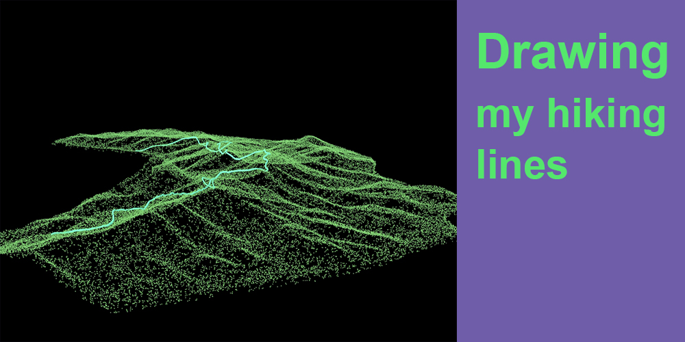

# DRAWING MY HIKING LINES

## Authors
- Xiaojun Wang, https://github.com/Lolita-wang
- Jianchuan Huang

## Description
We are students of China academy of art. This project is our graduation design.
In hangzhou, mountaineering is loved by citizens and tourists.Our team hope to use collections of mountaineering data to create interactive and beauty website and APP.With our footprints on the map drawing, with others to share their hiking trails, enjoy 3D map interesting visual changes.

